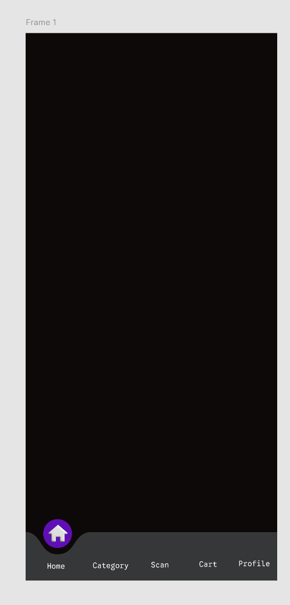
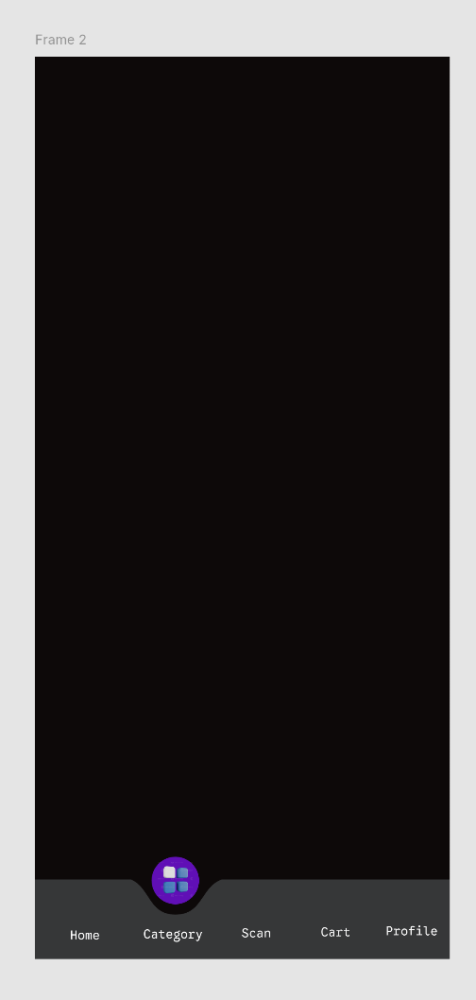
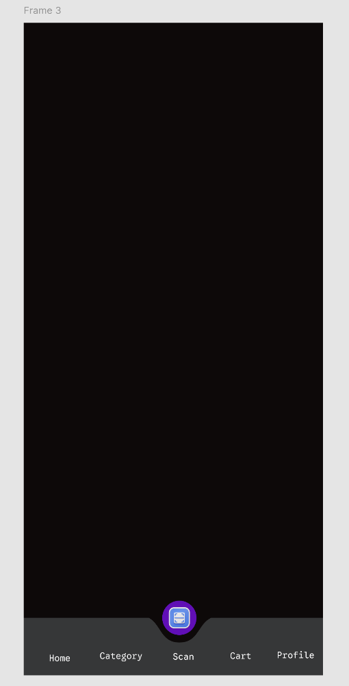
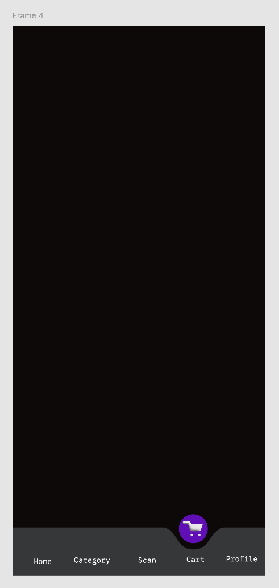
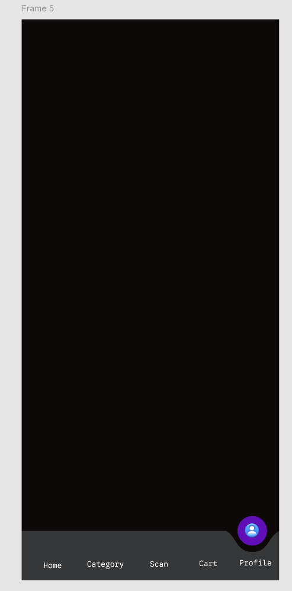

# figma-navigation-bar
Responsive navigation bar designed and prototyped in Figma.
# Figma Navigation Bar

A navigation bar UI designed and prototyped using Figma.

## Features

- Navigation menu
- Interactive navigation elements
- Clean and simple UI
- Clickable prototype interactions

## Tools Used

- Figma
- UI/UX Design
- Prototyping

## Figma Prototype

[View the Interactive Prototype](https://www.figma.com/proto/d6ik6m7RTXyba6jIrdCXo9/Figma-basics?node-id=604-83&t=1TdLLuj7K0xEvPdO-1&scaling=scale-down&content-scaling=fixed&page-id=1669%3A162202&starting-point-node-id=604%3A47)

## Screenshots

